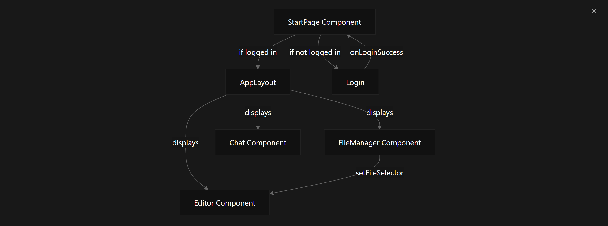
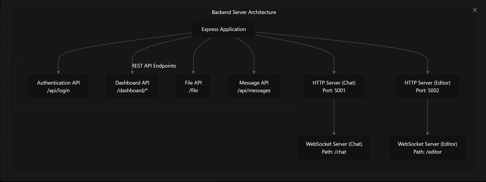
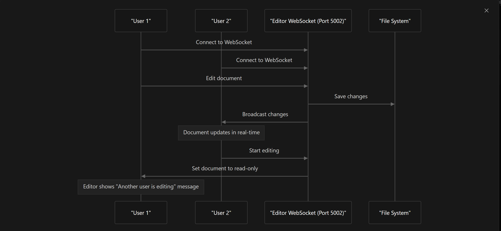
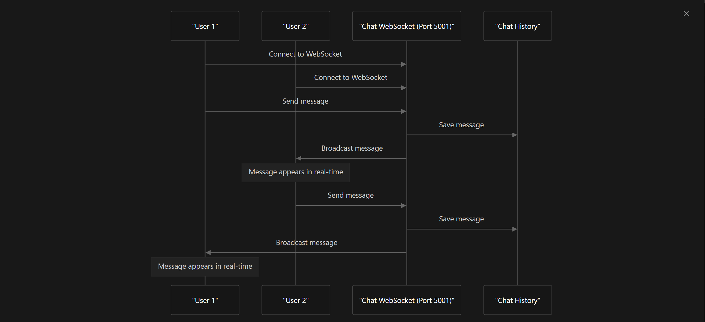
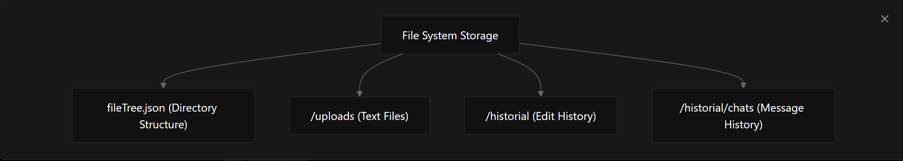

# Instrucciones para ejecutar el proyecto

Este proyecto incluye un frontend basado en React y un backend con WebSocket. Sigue los pasos a continuación para ejecutar ambos.

---

## 1. Ejecutar el frontend

1. Abre una terminal y navega a la carpeta raíz del proyecto.
2. Instala las dependencias necesarias:
   ```bash
   npm install
   ```
3. Inicia el servidor de desarrollo del frontend:
   ```bash
   npm run dev
   ```
4. El frontend estará disponible en [http://localhost:5173](http://localhost:5173) (o el puerto que indique la terminal).

---

## 2. Ejecutar el backend (WebSocket)

1. Abre una nueva terminal y navega a la carpeta `backend`:
   ```bash
   cd backend
   ```
2. Instala las dependencias necesarias:
   ```bash
   npm install
   ```
3. Inicia el servidor backend con WebSocket:
   ```bash
   npx ts-node server.ts
   ```
4. El backend estará escuchando en [http://localhost:5001](http://localhost:5001).

---

## Notas

- Asegúrate de que tanto el frontend como el backend estén ejecutándose al mismo tiempo para que la aplicación funcione correctamente.
- Si necesitas que el backend se reinicie automáticamente al guardar cambios, puedes usar:
   ```bash
   npx ts-node-dev server.ts
   ```


---
---

# Visión general

Este documento proporciona una introducción general al proyecto **M06_PR09**, un entorno colaborativo basado en la web que permite la edición de documentos en tiempo real, gestión de archivos y comunicación por chat entre usuarios.

---

## Propósito

**M06_PR09** está diseñado para facilitar el trabajo colaborativo permitiendo que varios usuarios puedan:

- Editar documentos de texto en tiempo real con cambios sincronizados  
- Comunicarse mediante un sistema de chat integrado  
- Gestionar una estructura de archivos compartida con carpetas y documentos  
- Autenticarse y mantener sesiones de usuario activas  

---

## Descripción general

La aplicación **M06_PR09** implementa una arquitectura web moderna con un frontend en **React** y un backend en **Node.js** con **Express**. El sistema utiliza **WebSockets** para las funcionalidades en tiempo real y un mecanismo de almacenamiento basado en archivos.

---

## Componentes clave

### Componentes del Frontend

El frontend está construido con **React** y consta de varios componentes principales:

- **Página de Inicio**: Componente central que gestiona la autenticación de usuarios y muestra la interfaz principal de la aplicación.  
- **Gestor de Archivos**: Proporciona un navegador jerárquico de archivos con operaciones básicas.  
- **Editor**: Editor de texto con capacidades de edición colaborativa en tiempo real.  
- **Chat**: Componente de mensajería en tiempo real con historial de mensajes.



### Servicios del Backend

El backend está desarrollado con **Node.js** y **Express**, e incluye varios servicios:

- **Servidor Express**: Gestiona peticiones HTTP y contenido estático.  
- **WebSocket de Chat**: Gestiona la mensajería en tiempo real en el puerto **5001**.  
- **WebSocket de Editor**: Gestiona la edición colaborativa en tiempo real en el puerto **5002**.  
- **APIs REST**: Para autenticación, operaciones de archivos y panel de control.  

## Arquitectura del Backend

El backend está estructurado con **dos servidores HTTP separados**:

- **Servidor de Chat (Puerto 5001)**: Gestiona las conexiones WebSocket del chat y las peticiones HTTP relacionadas.  
- **Servidor de Editor (Puerto 5002)**: Dedicado exclusivamente a las conexiones WebSocket para la edición colaborativa.  

Esta separación permite que el sistema maneje la edición en tiempo real y la comunicación por chat de forma independiente, lo que mejora la escalabilidad y el aislamiento de errores.

---

## Endpoints de la API REST

El backend expone varios endpoints REST para gestionar distintos aspectos de la aplicación:

| Endpoint                | Método | Propósito                                 | Archivo         |
|-------------------------|--------|-------------------------------------------|-----------------|
| `/api/login`            | POST   | Autentica a los usuarios                  | `auth.ts`       |
| `/dashboard/tree`       | GET    | Recupera la estructura de directorios     | `dashboard.ts`  |
| `/dashboard/directory`  | POST   | Crea nuevas carpetas                      | `dashboard.ts`  |
| `/dashboard/rename`     | POST   | Renombra archivos o carpetas              | `dashboard.ts`  |
| `/dashboard/edit`       | POST   | Actualiza los metadatos de las carpetas   | `dashboard.ts`  |
| `/dashboard`            | DELETE | Elimina archivos o carpetas               | `dashboard.ts`  |
| `/file`                 | GET    | Recupera el contenido de un archivo       | `file.ts`       |
| `/api/messages`         | Varios | Gestiona los mensajes del chat            | `messages.ts`   |

La aplicación de Express está configurada con soporte para **CORS** y análisis de cuerpos JSON (**JSON body parsing**) para permitir solicitudes entre distintos orígenes y manejar datos en formato JSON dentro de los cuerpos de las peticiones.



---

## Funcionalidades de Colaboración en Tiempo Real

### Edición Colaborativa

El componente **Editor** permite que varios usuarios trabajen sobre el mismo documento con sincronización en tiempo real.



### Mensajería por Chat

El componente **Chat** permite a los usuarios comunicarse en tiempo real.



---

## Almacenamiento de Datos

El sistema utiliza un enfoque de almacenamiento basado en archivos:

- `fileTree.json`: Contiene la estructura jerárquica de archivos  
- `/uploads`: Contiene los contenidos de los archivos de texto  
- `/historial/edits`: Mantiene el historial de ediciones de documentos compartidos
- `/historial/chats`: Almacena el historial de mensajes del chat



---

## Interfaz de Usuario

La aplicación proporciona una interfaz integrada que combina la gestión de archivos, la edición de documentos y la funcionalidad de chat.

---

## Gestión de Sesiones

El sistema implementa un mecanismo simple de gestión de sesiones usando `sessionStorage` del navegador:

- Tras un inicio de sesión exitoso, la información del usuario se almacena en `sessionStorage`  
- La aplicación verifica la existencia de una sesión al iniciarse  
- El cierre de sesión elimina los datos de la sesión  
